<h1> Açıklama </h1>

<strong>Linux Shell Programlama</strong> kullanılarak Türkçe ve İngilizce için sayıdan yazı   ve yazıdan sayı dönüşümü yapabilen, ayrıca yazı olarak verilmiş iki sayı üzerinde  toplama, ve çıkarma işlemlerinin yapılabildiği bir  Linux betiği gerçeklenecektir. 

 <h2 style="display: inline-block;">1 - Şekil1:</h2> Dil seçeneği sorgusu 

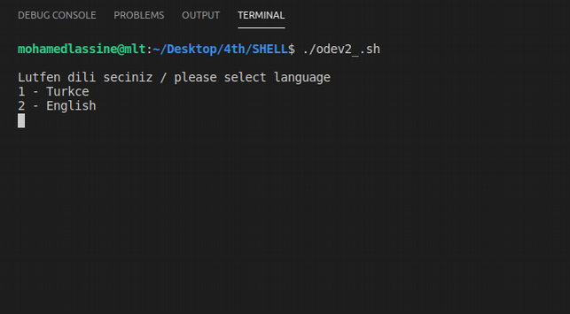

 <h2 style="display: inline-block;">2 - Şekil2:</h2> Dil seçeneği girişi 

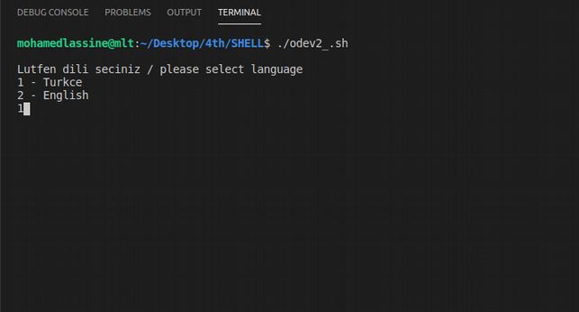

 <h2 style="display: inline-block;">3 - Şekil3:</h2> Yapılacak işlem menüsü 

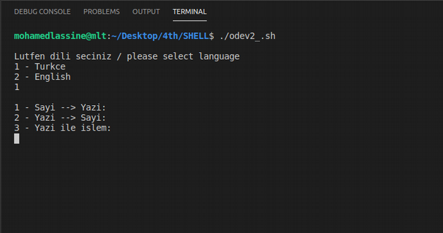

 <h2 style="display: inline-block;">4 - Şekil4:</h2> Yazıya çevrilmesi gereken nümerik değer sorgusu 

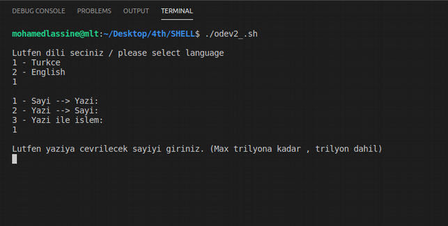

 <h2 style="display: inline-block;">5 - Şekil5:</h2> Yazıya çevrilmesi gereken nümerik değer girişi 

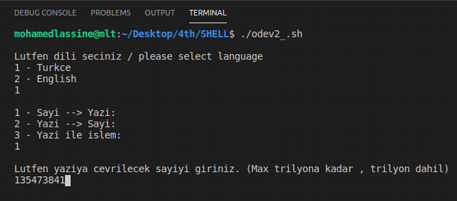

 <h2 style="display: inline-block;">6 - Şekil6:</h2> Yazıya çevrilmiş sayı cevabı 

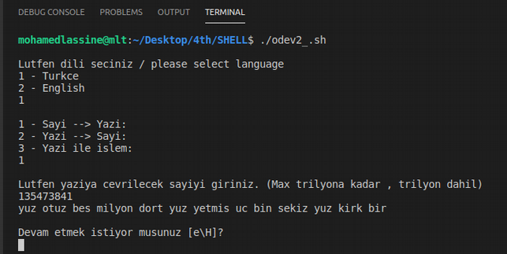

 <h2 style="display: inline-block;">7 - Şekil7:</h2> Devam etmek için evet seçildi 

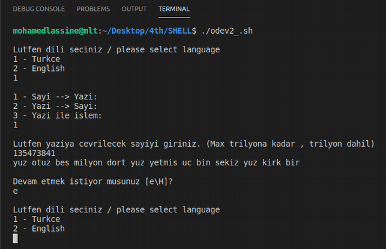

 <h2 style="display: inline-block;">8 - Şekil8:</h2>  H(Hayır) seçildiğinde program sonlandırıldı 

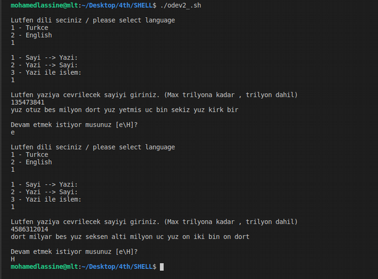

 <h2 style="display: inline-block;">9 - Şekil9:</h2> Kullanıcı yanlış değeri girdisi 

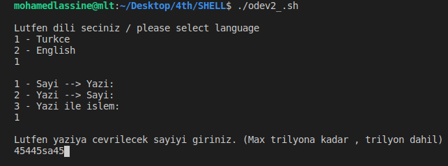

 <h2 style="display: inline-block;">10 - Şekil10:</h2> Kullanıcı yanlış değer girdi uyarısı 

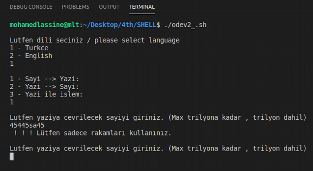

 <h2 style="display: inline-block;">11 - Şekil11:</h2> Sayıya çevrilmesi gereken yazı sorgusu 

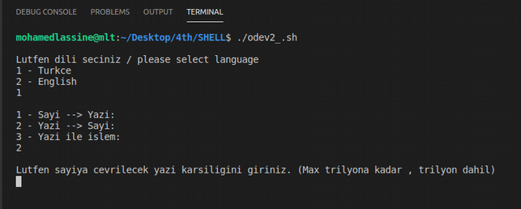

 <h2 style="display: inline-block;">12 - Şekil12:</h2> Sayıya çevrilmesi gereken nümerik değerin yazı karşılığı girişi 

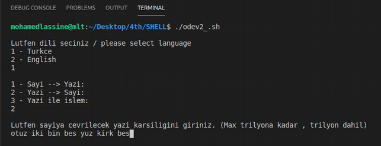

 <h2 style="display: inline-block;">13 - Şekil13:</h2> Sayıya çevrilmiş yazı cevabı 

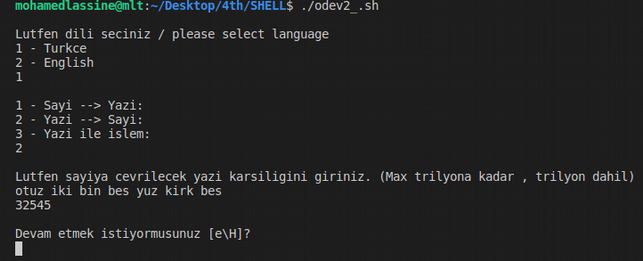

 <h2 style="display: inline-block;">14.1 - Şekil14.1:</h2> Evet için e girildi 

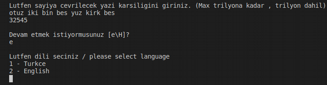

 <h2 style="display: inline-block;">14.2 - Şekil14.2:</h2> Hayır için H girildi 

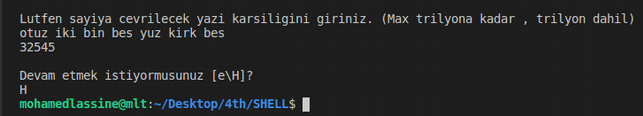

 <h2 style="display: inline-block;">15.1 - Şekil15.1:</h2> Kullanıcı hata girdi uyarısı ve hatayı gösterme 

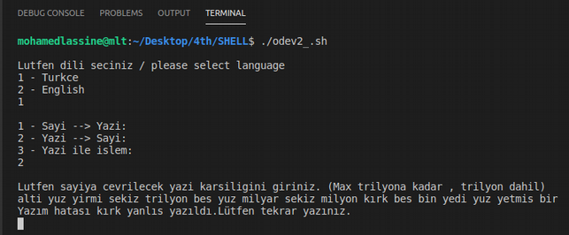

 <h2 style="display: inline-block;">15.2 - Şekil15.2:</h2> Kullanıcı hata düzeltilmesi ve yeniden denemesi 

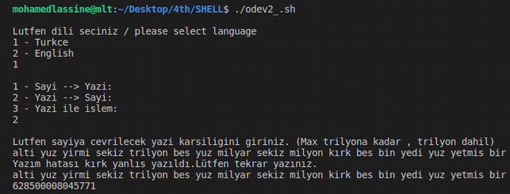

 <h2 style="display: inline-block;">16 - Şekil16:</h2> Yazı ile işlem menüsü 

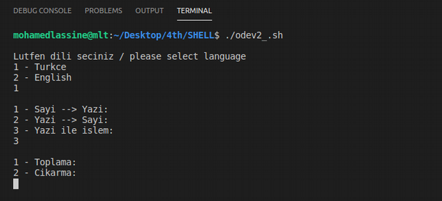

 <h2 style="display: inline-block;">17 - Şekil17:</h2> Operand1 sorgusu 

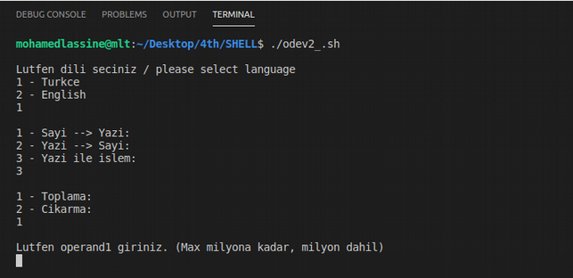

 <h2 style="display: inline-block;">18 - Şekil18:</h2> Operand1 girişi ve operand2 sorgusu 

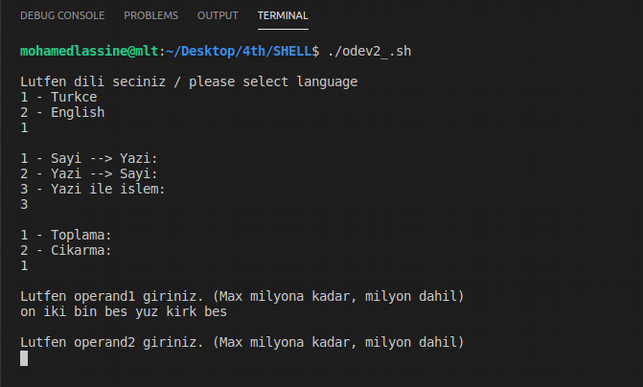

 <h2 style="display: inline-block;">19 - Şekil19:</h2> Toplama işleminin sonucu 

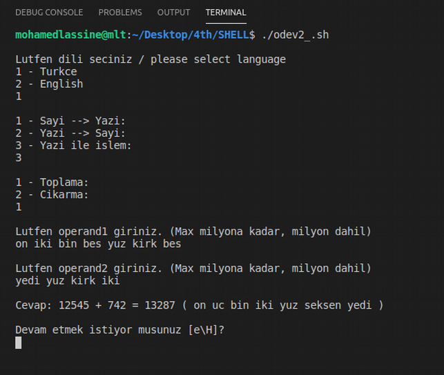

 <h2 style="display: inline-block;">20 - Şekil20:</h2> Çıkarma işleminin *sonucu (pozitif olma durumu) 

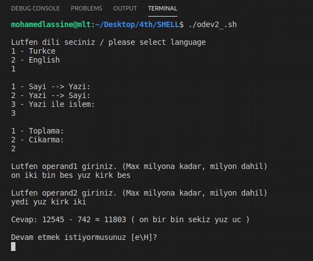

 <h2 style="display: inline-block;">21 - Şekil21:</h2> YÇıkarma işleminin *sonucu (negatif olma durumu) 

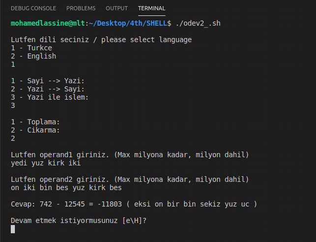

 <h2 style="display: inline-block;">22 - Şekil22:</h2> Yanlış operandların girişi ve düzeltilmesi 

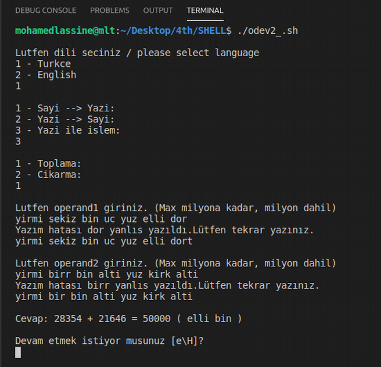